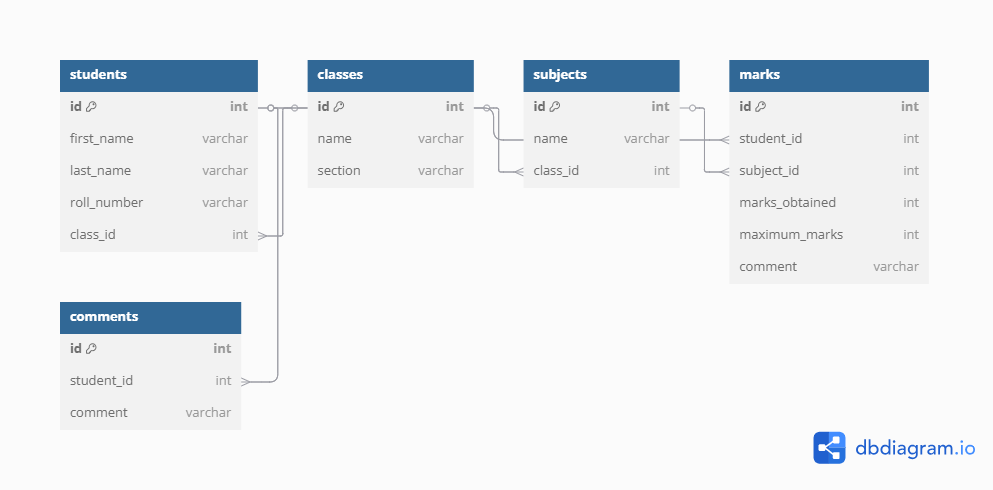

# 📘 Phase 1 – System Design  
**Scope**:  
- Database Schema 
- API Design   
- System Flow Explanation  

---

## 🔸 Database Schema (Tables)

#### `students`
- `id` (Primary Key)
- `first_name`
- `last_name`
- `roll_number`
- `class_id` (Foreign Key → `classes.id`)

#### `classes`
- `id` (Primary Key)
- `name` (e.g., "Class 5")
- `section` (e.g., "A")

#### `subjects`
- `id` (Primary Key)
- `name`
- `class_id` (Foreign Key → `classes.id`)

#### `marks`
- `id` (Primary Key)
- `student_id` (Foreign Key → `students.id`)
- `subject_id` (Foreign Key → `subjects.id`)
- `marks_obtained`
- `maximum_marks`
- `comment` (e.g., "Excellent", "Needs improvement")

#### `comments`
- `id` (Primary Key)
- `student_id` (Foreign Key → `students.id`)
- `comment` (Final Grade/Remarks, e.g., "Grade A+ - Pass")


## 🗂️ ER Diagram



---
### 1. POST `/api/students`

**Description**: Add a new student along with subjects, marks, and final comment.

#### Request Body

```json
{
  "first_name": "Ajay",
  "last_name": "Kumar",
  "roll_number": 101,
  "class_id": 1,
  "subjects": [
    {
      "subject_id": 1,
      "marks_obtained": 65,
      "maximum_marks": 100,
      "comment": "Need improvement"
    },
    {
      "subject_id": 2,
      "marks_obtained": 90,
      "maximum_marks": 100,
      "comment": "Excellent work"
    }
  ]
}
```

#### Response

```json
{
  "status": "success",
  "message": "Student data saved successfully"
}
```

---

### 2. GET `/api/students/{id}/reportcard`

**Description**: Retrieve the full report card for a student using their ID.

#### Example Response

```json
{
  "status": "success",
  "student": {
    "first_name": "Ajay",
    "last_name": "Kumar",
    "roll_number": 101,
    "class": "Class 5",
    "section": "A"
  },
  "subjects": [
    {
      "subject_name": "Math",
      "marks_obtained": 85,
      "maximum_marks": 100,
      "comment": "Good progress"
    },
    {
      "subject_name": "Science",
      "marks_obtained": 90,
      "maximum_marks": 100,
      "comment": "Excellent work"
    }
  ],
  "Grade": "Grade A+ - Pass" ,
  "Final comment message": "Student has shown great improvement and successfully promoted"

}
```

---

### 3. POST `/api/reportcard/generate`

**Description**: Generate a report card for a student and return a downloadable PDF URL.

#### Request Body

```json
{
  "student_id": 101
}
```

#### Example Response

```json
{
  "status": "success",
  "message": "Report card generated",
  "fileUrl": "http://example.com/reportcard/101.pdf"
}
```

## 🔸 System Flow

### Step-by-Step Flow

#### 1. Student & Class Setup (Admin/Teacher)
- The **Admin/Teacher** adds students to the system.
- Each student is assigned to a **class** and **section** (e.g., "Grade 5 - A").
- **Subjects** are configured for each class (e.g., Math, Science, English).

#### 2. Subject Marks Entry 
- The **Teacher** enters the marks for each student under the relevant subject.
- For each student and subject, the marks obtained and the maximum marks are recorded.
- Additionally, the teacher provides **comments** for each subject based on the student's performance (e.g., "Good progress", "Needs improvement").

#### 3. Comments Entry (Optional)
- The **Principal** provides additional feedback, if necessary, for each student.
- The **grade** (e.g., "Grade A+ - Pass") is calculated automatically based on the student's performance across all subjects.

#### 4. Report Card Generation (System)
- The system aggregates the following data for the report card:
  - Student personal details (name, roll number, class, section)
  - Subject-wise marks and comments
  - **Final grade** based on the marks entered (calculated automatically)
  - **Overall comments** provided by the teacher and principal

#### 5. Report Card Preview
- The system generates a **report card preview**.
- The report card is displayed with:
  - Student details
  - Subject-wise marks and comments
  - Final grade and overall comments

#### 6. Downloadable PDF 
- Upon clicking the Download button, the user can download the report card in **PDF format**.
- The system generates a **PDF file** using libraries like **FPDF** or tools like **ReportLab**, ensuring it is properly styled and formatted for printing or sharing.


